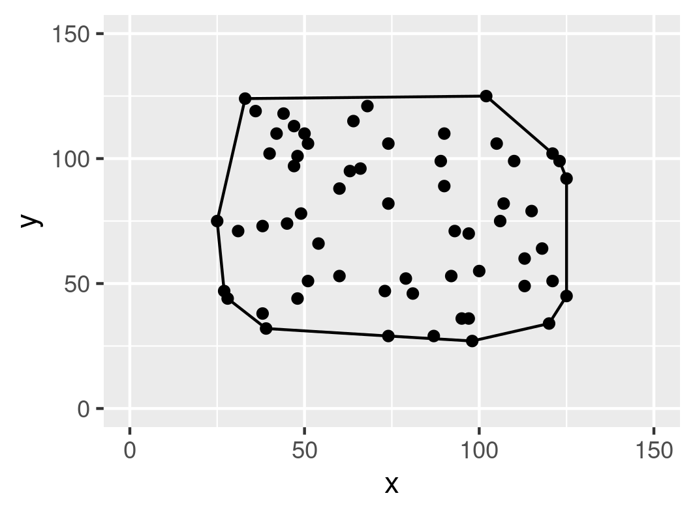

## Demonstrations of different interesting algorithms

1. Andrew's Algorithm for finding the polygon that outlines or bounds
   a set of a points.
   - R version   : complete
   - C++ version : incomplete 
   

## Build instructions
   For R examples, either open in RStudio, or open file in R by typing:
   ```
   R
   source("filename.r")
   ```
   For c++ examples, first make sure **sdl2-dev** is installed. Then either modify the 
   *build.sh* script or go to the **build** directory and type: 
   ``` 
   cmake ..
   make
   ```
